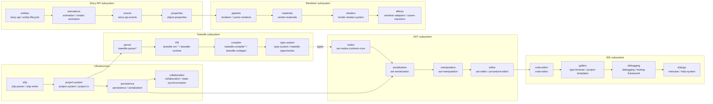

# Subsystem Map

This atlas page groups the TypeScript codebase into the major authoring, runtime, rendering, and infrastructure subsystems.

```mermaid
flowchart LR
    subgraph Tweedle["Tweedle subsystem"]
        parser["parser<br/>tweedle-parser*"] --> vm["VM<br/>tweedle-vm-* / tweedle-runtime"]
        vm --> compiler["compiler<br/>tweedle-compiler* / tweedle-codegen"]
        compiler --> typeSystem["type-system<br/>type-system / tweedle-typechecker"]
    end

    subgraph AST["AST subsystem"]
        nodes["nodes<br/>ast-nodes-common-core"] --> serialization["serialization<br/>ast-serialization"]
        serialization --> manipulation["manipulation<br/>ast-manipulation"]
        manipulation --> editor["editor<br/>ast-editor / procedure-editor"]
    end

    subgraph StoryAPI["Story API subsystem"]
        entities["entities<br/>story-api / entity-lifecycle"] --> animations["animations<br/>animation / render-animation"]
        animations --> events["events<br/>story-api-events"]
        events --> properties["properties<br/>object-properties"]
    end

    subgraph Renderer["Renderer subsystem"]
        pipeline["pipeline<br/>renderer / scene-renderer"] --> materials["materials<br/>render-materials"]
        materials --> shaders["shaders<br/>render-shader-system"]
        shaders --> effects["effects<br/>renderer-adapters / scene-transition"]
    end

    subgraph IDE["IDE subsystem"]
        codeEditor["code-editor<br/>code-editor"] --> gallery["gallery<br/>type-browser / project-templates"]
        gallery --> debugging["debugging<br/>debugging / testing-framework"]
        debugging --> dialogs["dialogs<br/>menubar / help-system"]
    end

    subgraph Infra["Infrastructure"]
        a3p["a3p<br/>a3p-parser / a3p-writer"] --> projectSystem["project-system<br/>project-system / project-io"]
        projectSystem --> persistence["persistence<br/>persistence / serialization"]
        persistence --> collaboration["collaboration<br/>collaboration / state-synchronization"]
    end

    typeSystem -. types .-> nodes
    editor --> codeEditor
    properties --> pipeline
    projectSystem --> parser
    persistence --> serialization
```
